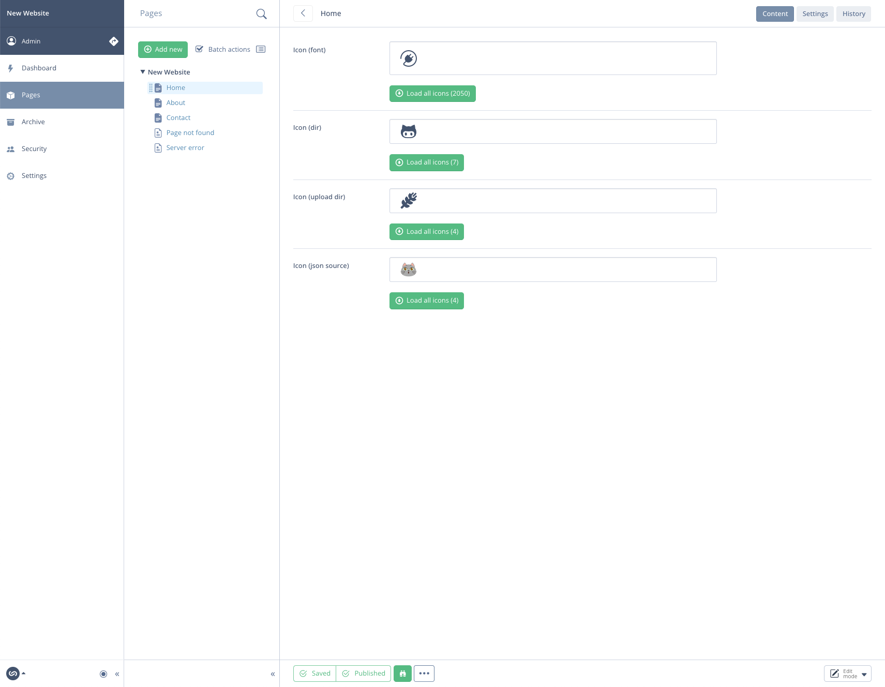
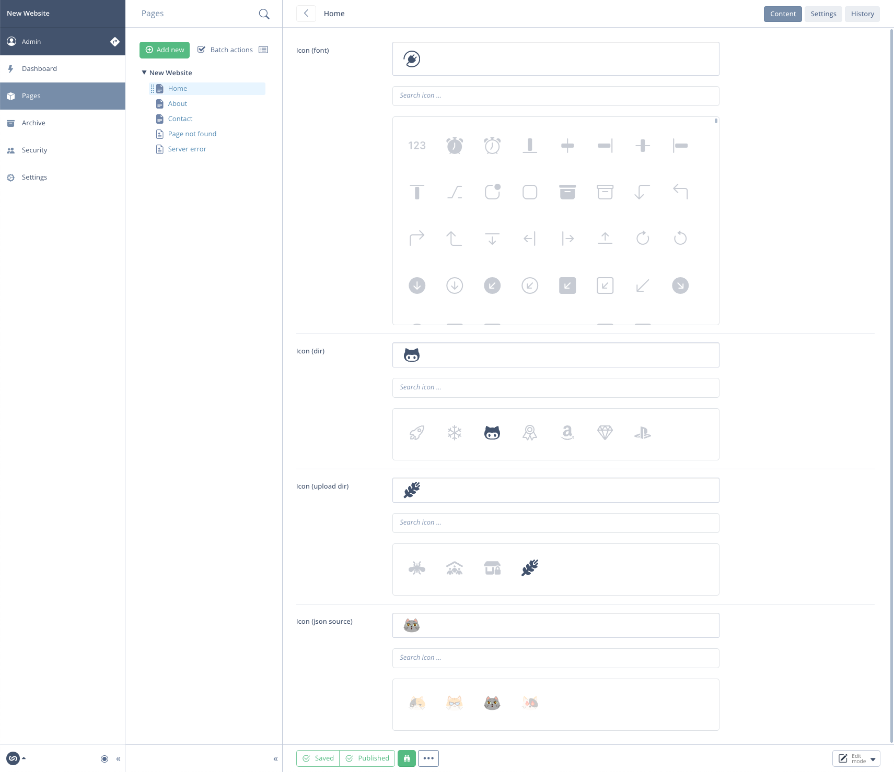
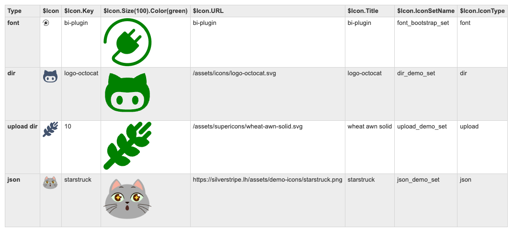

# 🦅 Icon Field for Silverstripe

[](https://packagist.org/packages/goldfinch/icon-field)
[](https://packagist.org/packages/goldfinch/icon-field)
[](https://packagist.org/packages/goldfinch/icon-field)
[](https://packagist.org/packages/goldfinch/icon-field) 

Advanced Icon Field for Silverstripe. It can handle up to 4 different types of icon sources:

- font icons (css file)
- directory (icons within specific folder)
- upload folder (folder through SilverStripe assets module)
- json (source file)

## Install

```bash
composer require goldfinch/icon-field
```

## Available Taz commands

If you haven't used [**Taz**](https://github.com/goldfinch/taz)🌪️ before, *taz* file must be presented in your root project folder `cp vendor/goldfinch/taz/taz taz`

---

> Add new icon set
```bash
php taz iconset
```

> Publish icon templates
```bash
php taz vendor:icon-field:templates
```

## Quick Bootstrap icon set setup

1) Copy json set of all current bootstrap icons

```bash
cp vendor/goldfinch/icon-field/examples/icon-bootstrap.json app/_schema/icon-bootstrap.json
```

2) Add config for this set

```yml
Goldfinch\IconField\Forms\IconField:
  icons_sets:
    bootstrap:
      type: font
      source: 'https://cdn.jsdelivr.net/npm/bootstrap-icons@1.11.3/font/bootstrap-icons.min.css'
```

3) Use field with this set

```php
use Goldfinch\IconField\Forms\IconField;

IconField::create('bootstrap', 'Icon')
```

## Usage

```php
use Goldfinch\IconField\Forms\IconField;

class Page
{
    private static $db = [
        'Icon' => 'Icon',
    ];

    public function getCMSFields()
    {
        $fields = parent::getCMSFields();

        $fields->insertBefore('Content', IconField::create('icon_set_name', 'Icon'));
    }
}
```

```html
<!-- template.ss -->

$Icon
$Icon.Key
$Icon.Size(100).Color(green)
$Icon.URL
$Icon.Title
$Icon.IconSetName
$Icon.IconType
```

## Vite support

If you use [Vite](https://github.com/swordfox/vite) as a front-end build tool, you might want to include a dynamic vite link as a source for your icons. Easy, just use prefix `vite:` followed by relative path to the file of your build, as you have it in your `vite.config.js`.

*example:*

```yml
Goldfinch\IconField\Forms\IconField:
  icons_sets:
    my_icons_set:
      type: font
      source: 'vite:themes/main/src/icons.scss'

```

## Previews

#### Icon (unloaded sets)

#### Icon (loaded sets)

#### Demo output (all types)


## Sidenotes

* If your set contains icons as PNG files, make sure to set property `vector: false` in your set configuration

* When using `dir` set type, your icon dir store in public (eg: `public/my-icons`) might have access issues due to rules in `.htaccess`. If that's your case, just move your icons to `assets` dir, (eg: `public/assets/my-icons`) and update `source` parameter in your .yml file.

## License

The MIT License (MIT)
